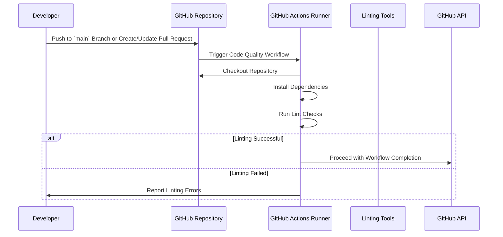

# Code Quality

## Overview

The following sequence diagram illustrates the interactions and steps involved in the **Code
Quality** workflow, triggered by a push to the `main` branch or a pull request.



## Quick Start

**Configuring Necessary Secrets**

For the Release workflow to function correctly, certain secrets must be configured in your GitHub
repository settings.

a. Navigate to Repository Settings

1. Go to your repository on GitHub.
2. Click on Settings.

b. Access Secrets

1. In the left sidebar, click on Secrets and variables > Actions.

c. Add Required Secrets

1. **GITHUB_TOKEN**: Automatically provided by GitHub Actions; no need to add manually unless
   customizing permissions.

**Create the Release Workflow File in the Consuming Repository**

```yaml
name: Code Quality

on:
  pull_request:
  push:
    branches:
      - main

jobs:
  code-quality:
    uses: kurocado-studio/styleguide/.github/workflows/lint.yml@main
    secrets: inherit
```
