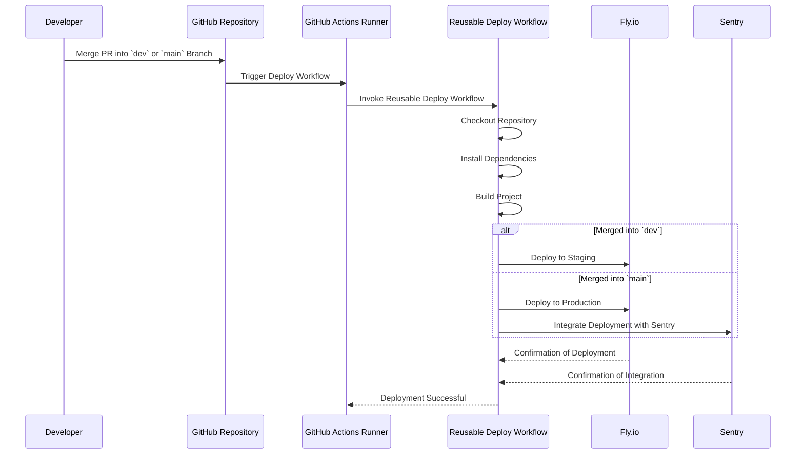

# Deploy Workflow

## Prerequisites

- [An account with fly.io](https://fly.io)
- [An account with sentry.io](https://sentry.io/welcome/)
- [An app configuration (fly.toml)](https://fly.io/docs/reference/configuration/)

## Overview

Automates the deployment process, including deploying to staging and production environments based
on branch merges. The Deploy workflow listens for pull request merges into the `dev` and `main`
branches and triggers deployments accordingly.

The following sequence diagram illustrates the interactions and steps involved in the Deploy
workflow, triggered by the merging of a pull request into the `dev` or `main` branch.



## Step 1 — Configure Necessary Secrets

For the Deployment workflow to function correctly, certain secrets must be configured in your GitHub
repository settings. These secrets ensure secure access to necessary tools and services during the
workflow execution.

### a. Navigate to Repository Settings

1. Go to your repository on GitHub.
2. Click on the **Settings** tab.

### b. Access Secrets

1. In the left sidebar, click on **Secrets and variables** under the **Security** section.
2. Select **Actions** to manage secrets for GitHub Actions.

### c. Add Required Secrets

1. **FLY_API_TOKEN**:Your Fly.io API token for authenticating deployments.
2. **SENTRY_AUTH_TOKEN**: Your Sentry authentication token for integrating deployments with Sentry.
3. **Additional Secrets**: If your workflow requires access to other external services or APIs
   (e.g., database credentials, API keys), add them here by clicking on New repository secret and
   providing the necessary name and value.

## Step 2 — Create the Deployment Workflow File

Create a GitHub Actions workflow file that defines the automated steps for deploying your project to
staging and production environments

### a. Add the Workflow File

1. In your repository, navigate to the `.github/workflows/` directory. If it doesn't exist, create
   it.
2. Create a new file named `deployment.yml` (or any name of your choice).

### b. Define the Workflow

Add the following content to the `deployment.yml` file:

```yaml
name: Deploy on PR Merge

on:
  pull_request:
    types: [closed]
    branches:
      - main
      - dev

jobs:
  deploy:
    name: Deploy
    if: github.event.pull_request.merged == true
    uses: kurocado-studio/styleguide/.github/actions/deploy@main
    with:
      commit_sha: ${{ github.event.pull_request.merge_commit_sha }}
    env:
      FLY_API_TOKEN: ${{ secrets.FLY_API_TOKEN }}
      SENTRY_AUTH_TOKEN: ${{ secrets.SENTRY_AUTH_TOKEN }}
```
