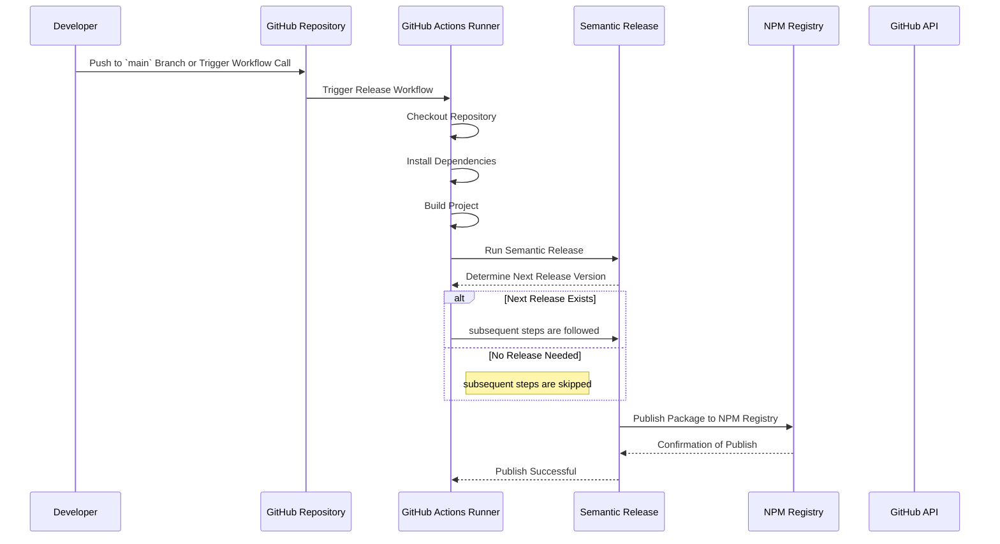

# Release Workflow

## Prerequisites

- [Semantic Release Setup](How-To-Install-Semantic-Release.md)

## Overview

Automates the release process, including versioning, changelog generation, and pull request
creation.

The following sequence diagram illustrates the interactions and steps involved in the Release
workflow, triggered by a push to the `main` branch.



## Step 1 — Configure Necessary Secrets

### a. Navigate to Repository Settings

1. Go to your repository on GitHub.
2. Click on the **Settings** tab.

### b. Access Secrets

1. In the left sidebar, click on **Secrets and variables** under the **Security** section.
2. Select **Actions** to manage secrets for GitHub Actions.

### c. Add Required Secrets

1. **GITHUB_TOKEN**: This token is automatically provided by GitHub Actions and typically does not
   need to be added manually unless you require customized permissions.
2. **PAT_FORCE_PUSH**: Personal Access Token configured with the necessary scopes (permissions) to
   allow a GitHub Actions workflow to perform force push operations on a repository.
3. **Additional Secrets**: If your workflow requires access to external services or APIs (e.g.,
   authentication tokens, API keys), add them here by clicking on **New repository secret** and
   providing the necessary name and value.

## Step 2 — Add the Release Workflow

You’ll need to add the Release Workflow YAML file to your repository. This file defines the
automated steps for releasing your project.

### a. Add the Workflow File

1. In your repository, navigate to the `.github/workflows/` directory. If it doesn't exist, create
   it.
2. Create a new file named `release.yml` (or any name of your choice).

### b. Define the Workflow

Add the following content to the `release.yml` file:

```yaml
name: Release Workflow

on:
  push:
    branches:
      - main

jobs:
  release:
    uses: kurocado-studio/styleguide/.github/workflows/release.yml@main
    secrets:
      GITHUB_TOKEN: ${{ secrets.GITHUB_TOKEN }}
      NPM_TOKEN: ${{ secrets.NPM_TOKEN }}
      PAT_FORCE_PUSH: ${{ secrets.GITHUB_TOKEN }}
```

### Full CI/CD Pipeline Example {collapsible="true"}

<code-block lang="yaml" src="ci.yml" />
