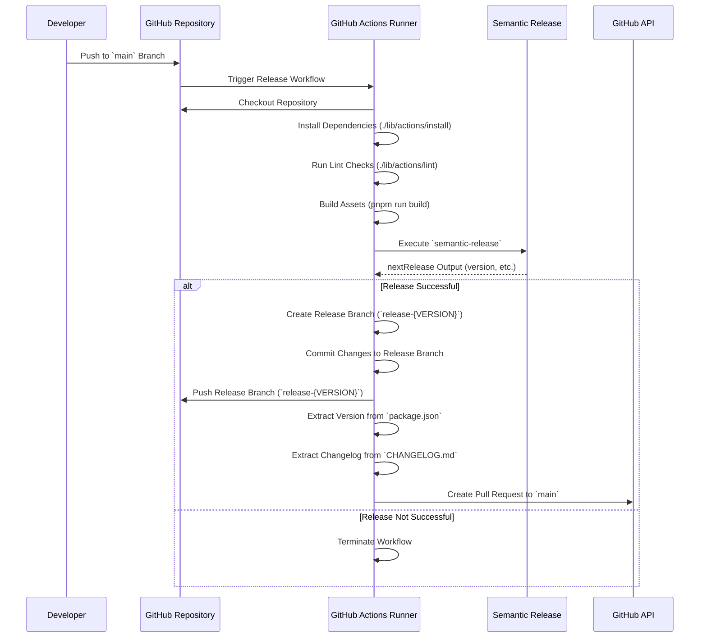

# Release

## Overview

The following sequence diagram illustrates the interactions and steps involved in the Release
workflow, triggered by a push to the `main` branch.

```mermaid
sequenceDiagram
    participant Developer
    participant GitHub as GitHub Repository
    participant Runner as GitHub Actions Runner
    participant Semantic as Semantic Release
    participant GitHubAPI as GitHub API

    Developer->>GitHub: Push to `main` Branch
    GitHub->>Runner: Trigger Release Workflow
    Runner->>GitHub: Checkout Repository
    Runner->>Runner: Install Dependencies (./lib/actions/install)
    Runner->>Runner: Run Lint Checks (./lib/actions/lint)
    Runner->>Runner: Build Assets (pnpm run build)
    Runner->>Semantic: Execute `semantic-release`
    Semantic-->>Runner: nextRelease Output (version, etc.)
    alt Release Successful
        Runner->>Runner: Create Release Branch (`release-{VERSION}`)
        Runner->>Runner: Commit Changes to Release Branch
        Runner->>GitHub: Push Release Branch (`release-{VERSION}`)
        Runner->>Runner: Extract Version from `package.json`
        Runner->>Runner: Extract Changelog from `CHANGELOG.md`
        Runner->>GitHubAPI: Create Pull Request to `main`
    else Release Not Successful
        Runner->>Runner: Terminate Workflow
    end
```
