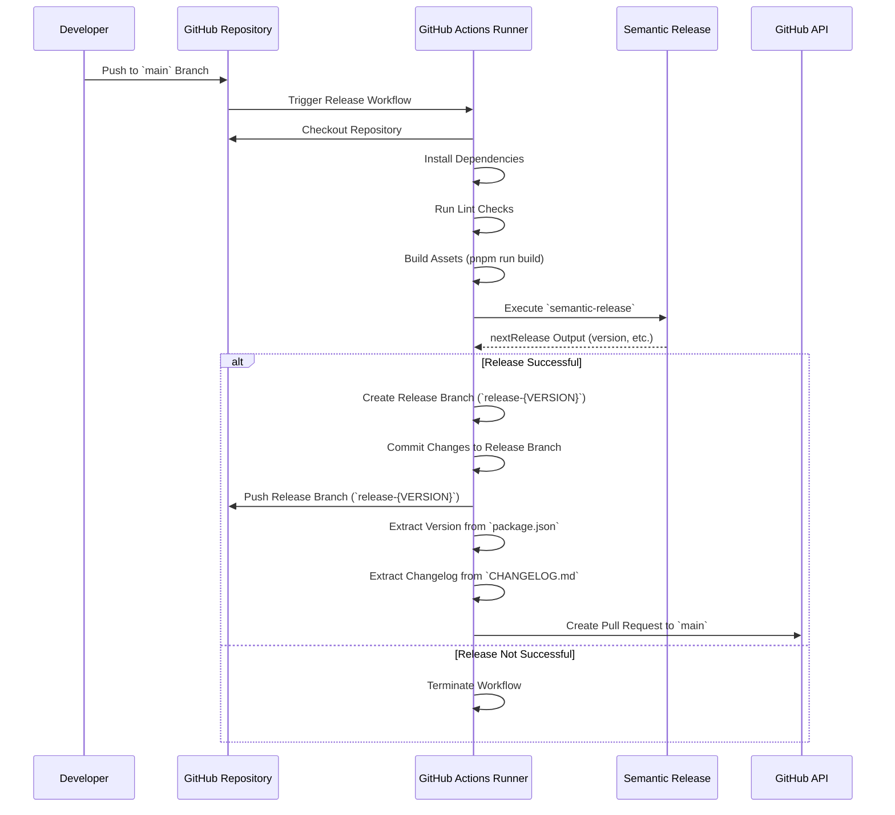

# Release Workflow

<note>
   <procedure title="The following needs to be configured" id="procedure-id">
      <step><a href="How-To-Install-Semantic-Release.md">Semantic Release</a></step>
   </procedure>
</note>

## Overview

Automates the release process, including versioning, changelog generation, and pull request
creation.

The following sequence diagram illustrates the interactions and steps involved in the Release
workflow, triggered by a push to the `main` branch.



## Quick Start

For the Release workflow to function correctly, certain secrets must be configured in your GitHub
repository settings.

a. Navigate to Repository Settings

1. Go to your repository on GitHub.
2. Click on Settings.

b. Access Secrets

1. In the left sidebar, click on Secrets and variables > Actions.

c. Add Required Secrets

1. **GITHUB_TOKEN**: Automatically provided by GitHub Actions; no need to add manually unless
   customizing permissions.
2. **NPM_TOKEN**: Authenticates with the NPM registry to publish packages.
3. **PAT_FORCE_PUSH**: Personal Access Token with permissions to push to protected branches and
   create branches.

**Create the Release Workflow File in the Consuming Repository with the below permissions**

```yaml
name: Release Workflow

permissions:
  pull-requests: write
  contents: write
  pages: write
  id-token: write

on:
  workflow_call:
  push:
    branches:
      - main

jobs:
  manage-release:
    uses: kurocado-studio/styleguide/.github/workflows/release.yml@main
    secrets: inherit
```

### Full CI/CD Pipeline Example {collapsible="true"}

<code-block lang="yaml" src="ci.yml" />
