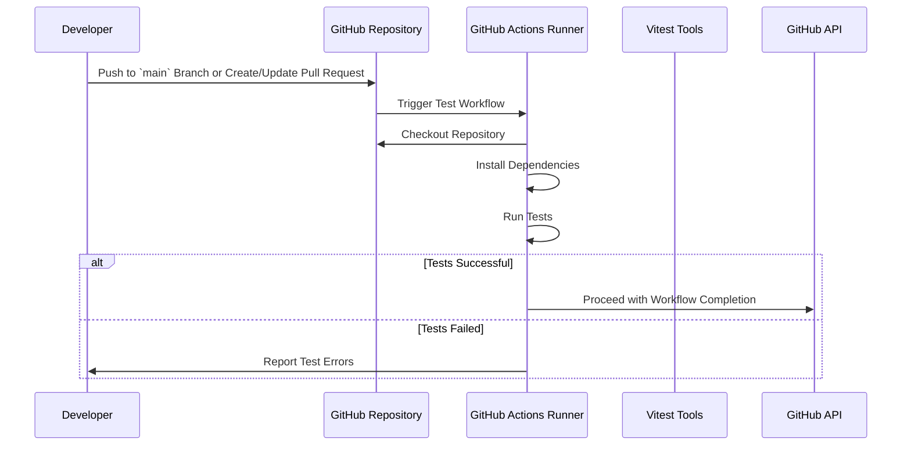

# Test Workflow

## Prerequisites

- [Vitest Setup](How-To-Install-Vitest.md)

## Overview

Ensures code consistency and quality through automated linting and formatting checks.

The following sequence diagram illustrates the interactions and steps involved in the **Test**
workflow, triggered by a push to the `main` branch or a pull request.



## Step 1 — Configure Necessary Secrets

For the Code Quality workflow to function correctly, certain secrets must be configured in your
GitHub repository settings. These secrets ensure secure access to necessary tools and services
during the workflow execution.

### a. Navigate to Repository Settings

1. Go to your repository on GitHub.
2. Click on the **Settings** tab.

### b. Access Secrets

1. In the left sidebar, click on **Secrets and variables** under the **Security** section.
2. Select **Actions** to manage secrets for GitHub Actions.

### c. Add Required Secrets

1. **GITHUB_TOKEN**: This token is automatically provided by GitHub Actions and typically does not
   need to be added manually unless you require customized permissions.
2. **Additional Secrets**: If your workflow requires access to external services or APIs (e.g.,
   authentication tokens, API keys), add them here by clicking on **New repository secret** and
   providing the necessary name and value.

## Step 2 — Create the Test Workflow File

Create a GitHub Actions workflow file that defines the steps for automated testing checks. This
workflow will be triggered by pushes to the `main` branch or the creation/update of pull requests.

### a. Add the Workflow File

1. In your repository, navigate to the `.github/workflows/` directory. If it doesn't exist, create
   it.
2. Create a new file named `test.yml` (or any name of your choice).

### b. Define the Workflow

Add the following content to the `test.yml` file:

```yaml
name: Code Quality

on:
  pull_request:
  push:
    branches:
      - main

jobs:
  code-quality:
    uses: kurocado-studio/styleguide/.github/workflows/test.yml@main
    secrets: inherit
```
