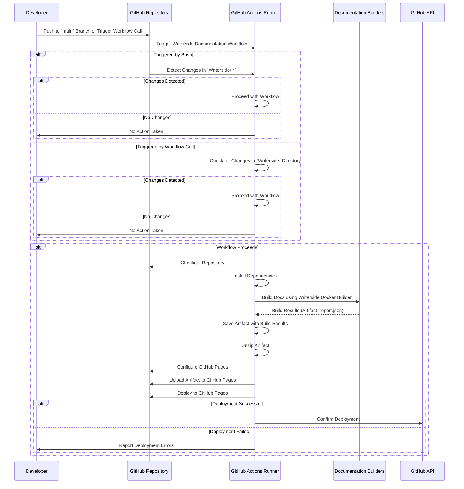

# Writerside Documentation Workflow

## Prerequisites

- Writerside
  - [Download Writerside Jetbrains Plugin](https://plugins.jetbrains.com/plugin/20158-writerside)
  - [Install Writerside IDE](https://www.jetbrains.com/writerside/)

## Overview

Builds and deploys project documentation using Docker-based builders.

The following sequence diagram illustrates the interactions and steps involved in the Writerside
Documentation workflow, triggered by a push to the main branch or a workflow call.



## Step 1 — Configure Necessary Secrets

### a. Navigate to Repository Settings

1. Go to your repository on GitHub.
2. Click on the **Settings** tab.

### b. Access Secrets

1. In the left sidebar, click on **Secrets and variables** under the **Security** section.
2. Select **Actions** to manage secrets for GitHub Actions.

### c. Add Required Secrets

1. **GITHUB_TOKEN**: This token is automatically provided by GitHub Actions and typically does not
   need to be added manually unless you require customized permissions.
2. **PAT_FORCE_PUSH**: Personal Access Token configured with the necessary scopes (permissions) to
   allow a GitHub Actions workflow to perform force push operations on a repository.
3. **Additional Secrets**: If your workflow requires access to external services or APIs (e.g.,
   authentication tokens, API keys), add them here by clicking on **New repository secret** and
   providing the necessary name and value.

## Step 2 — Add Writerside instance

**[See how to add Writerside instance](https://www.jetbrains.com/help/writerside/instances.html)**
<note>The name of the instance can be anything you want, the ID needs to be `dcs` in order for the
workflow to work correctly</note>

```yaml
name: Writerside Documentation

on:
  push:
    branches:
      - main

jobs:
  documentation:
    uses: kurocado-studio/styleguide/.github/workflows/writerside-documentation@main
    secrets: inherit
```

## Step 3 — Create the Writerside Workflow File

Create a GitHub Actions workflow file that defines the steps for automated testing checks. This
workflow will be triggered by pushes to the `main` branch or the creation/update of pull requests.

### a. Add the Workflow File

1. In your repository, navigate to the `.github/workflows/` directory. If it doesn't exist, create
   it.
2. Create a new file named `writerside.yml` (or any name of your choice).

### b. Define the Workflow

Add the following content to the `writerside.yml` file:

```yaml
name: Writerside Documentation

on:
  push:
    branches:
      - main

jobs:
  documentation:
    uses: kurocado-studio/styleguide/.github/workflows/writerside-documentation@main
    secrets: inherit
```

### Full CI/CD Pipeline Example {collapsible="true"}

<code-block lang="yaml" src="ci.yml" />
