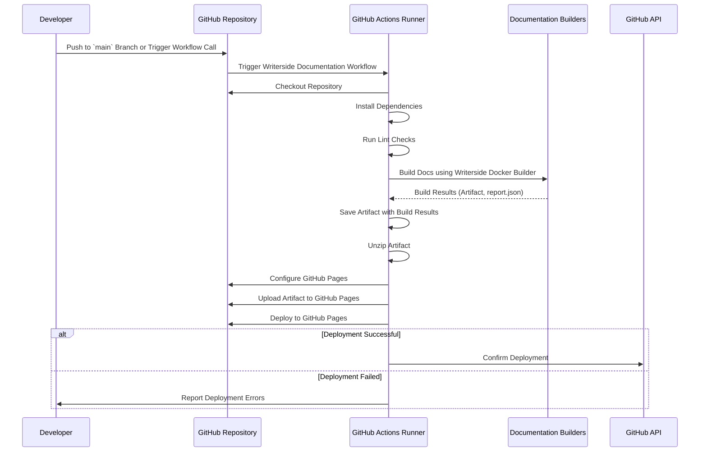

# Writerside

## Overview

The following sequence diagram illustrates the interactions and steps involved in the Writerside
Documentation workflow, triggered by a push to the main branch or a workflow call.



## Quick Start

**Configuring Necessary Secrets**

For the Release workflow to function correctly, certain secrets must be configured in your GitHub
repository settings.

a. Navigate to Repository Settings

1. Go to your repository on GitHub.
2. Click on Settings.

b. Access Secrets

1. In the left sidebar, click on Secrets and variables > Actions.

c. Add Required Secrets

1. **GITHUB_TOKEN**: Automatically provided by GitHub Actions; no need to add manually unless
   customizing permissions.

**Install Styleguide**

```
npm install --save-dev @kurocado-studio/styleguide
```

**Create the Release Workflow File in the Consuming Repository**

```yaml
# .github/workflows/writerside-documentation.yml
name: Writerside Documentation

on:
  workflow_call:
  push:
    branches:
      - main

permissions:
  contents: write
  pages: write
  id-token: write

env:
  INSTANCE: 'Writerside/dcs' # Name of the module (adjust for your project)
  ARTIFACT: 'webHelpDCS2-all.zip' # Name of the artifact to be generated
  DOCKER_VERSION: '242.21870' # Specific Docker version

jobs:
  build-and-deploy-docs:
    uses: @kurocado-studio/styleguide/.github/workflows/documentation.yml@v1
    secrets:
      GITHUB_TOKEN: ${{ secrets.GITHUB_TOKEN }}
```
